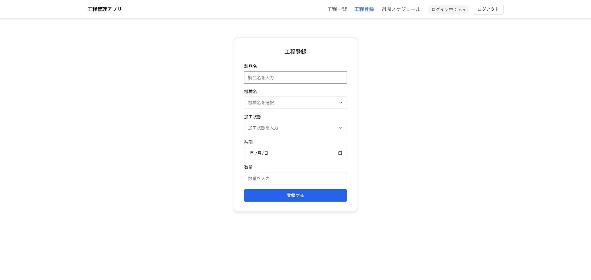

# 工程管理ツール

本アプリケーションは、私が勤務する工場での工程管理における、情報共有の手間やタイムラグといった課題を解決するために開発したWebアプリケーションです。  
工程情報をデジタル化しリアルタイムで共有できるようにするとともに、カンバン方式による直感的な操作で現場でも扱いやすい設計としています。

---

## 目次

- [概要](#概要)
- [背景・課題](#背景課題)
- [効果](#効果)
- [期待される効果](#期待される効果)
- [使用技術](#使用技術)
  - [フロントエンド](#フロントエンド)
  - [バックエンド](#バックエンド)
  - [データベース](#データベース)
  - [インフラ](#インフラ)
  - [その他](#その他)
- [機能一覧](#機能一覧)
  - [工程管理機能](#工程管理機能)
  - [週間工程管理機能](#週間工程管理機能)
- [画面説明](#画面説明)
  - [ログイン画面](#ログイン画面)
  - [一覧画面](#一覧画面)
  - [工程登録画面](#工程登録画面)
  - [週間スケジュール画面](#週間スケジュール画面)
- [使い方](#使い方)
- [セットアップ方法](#セットアップ方法)
  - [前提環境](#前提環境)
  - [1. リポジトリ取得](#1-リポジトリ取得)
  - [2. データベース作成](#2-データベース作成)
  - [3. ユーザー情報の登録](#3-ユーザー情報の登録)
  - [4. バックエンド起動](#4-バックエンド起動)
  - [5. フロントエンド起動](#5-フロントエンド起動)
- [工夫した点](#工夫した点)
  - [直感的な操作性・UI](#直感的な操作性ui)
  - [ログイン機能](#ログイン機能)
- [今後の開発予定](#今後の開発予定)

---

## 背景・課題

工場ではホワイトボードを用いて工程管理を行っており、工場間での情報共有は写真を撮影してLINEで送信していました。
この運用では、共有のたびに手間がかかるうえ、リアルタイム性に欠け、情報伝達にタイムラグが生じるという課題がありました。

---

## 効果

工程情報をWebアプリ上で一元管理することで、工場間でも常に最新の情報を共有できるようにしました。
さらに、カンバン方式を採用し直感的な操作性を実現するとともに、リアルタイムで工程状況を把握できる仕組みを構築しています。

---

## 期待される効果

- 写真撮影・送信の工数削減
- 工程状況のリアルタイム把握
- 情報共有の効率化

---

## 使用技術

### フロントエンド

- React（TypeScript）
- Chakra UI

### バックエンド

- Java（Spring Boot）

### データベース

- PostgreSQL

### インフラ

- Render

### その他

- Git / GitHub

---

## 機能一覧

### 工程管理機能

- 工程一覧の表示
- ステータス管理（未着手 / 進行中 / 完了）
- 工程の追加・編集・削除

### 週間工程管理機能

- カンバン形式での工程表示
- ドラッグ＆ドロップで工程の移動・並び替え

---

## 画面説明

### ログイン画面


ユーザー名とパスワードでログインします。

---

### 一覧画面


工程の一覧を確認できます。

---

### 工程登録画面


工程を新規で追加します。

---

### 週間スケジュール画面


工程をドラッグ＆ドロップで変更できます。

---

## 使い方

1. ログイン後、工程一覧画面で現在の作業状況を確認します
2. 必要に応じて工程を追加・編集します
3. 週間スケジュール画面で工程をドラッグ＆ドロップし、進捗状況を更新します
4. 更新内容は即時反映され、他の工場とも共有されます

---

## セットアップ方法

### 前提環境

- Node.js（v18以上）
- Java（17）
- PostgreSQL

### 1．リポジトリ取得

```bash
git clone https://github.com/sui08783/production-management.git
cd production-management
```

### 2.データベース作成

```bash
CREATE DATABASE production_management;
```

### 3. ユーザー情報の登録
※ テーブルはアプリ起動時に自動作成されます
```bash
INSERT INTO users (name, username, password, role) VALUES
('管理者', 'admin', '$2a$10$Xt9HRztAmIDIXkQaunXBtO0mMBm7tL856zOj9H9CAUgaVF8qk0Ufi', 'ROLE_ADMIN'),
('一般ユーザー', 'user', '$2a$10$cCTIKYzCIvlXkuTBfgAAYuOxENIPgxxwRFecUb//ZOY8NdxO5J6pu', 'ROLE_USER');
```

#### 管理者

- ユーザー名：admin
- パスワード：admin1234

##### 一般ユーザー

- ユーザー名：user
- パスワード：user1234

### 4.バックエンド起動

```bash
cd backend
.\gradlew.bat bootRun
```

### 5.フロントエンド起動

```bash
cd frontend
npm install
npm run dev
```

http://localhost:5173

---

## 工夫した点

### 直感的な操作性・UI

カンバン型のライブラリを使用し、直感的な操作を可能にすることで現場で働くPCの操作が苦手な人でも使いやすくしました 。

### ログイン機能

実際に使用することを想定し、Spring Securityを使用してログイン認証機能をつけました。

---

## 今後の開発予定

- 工程の検索・絞り込み機能
- ログインユーザーごとの機能権限付与
- 残りの納期期間ごとに色分け表示をして、わかりやすくする
- 画面サイズごとの表示の最適化(レスポンシブ対応)
